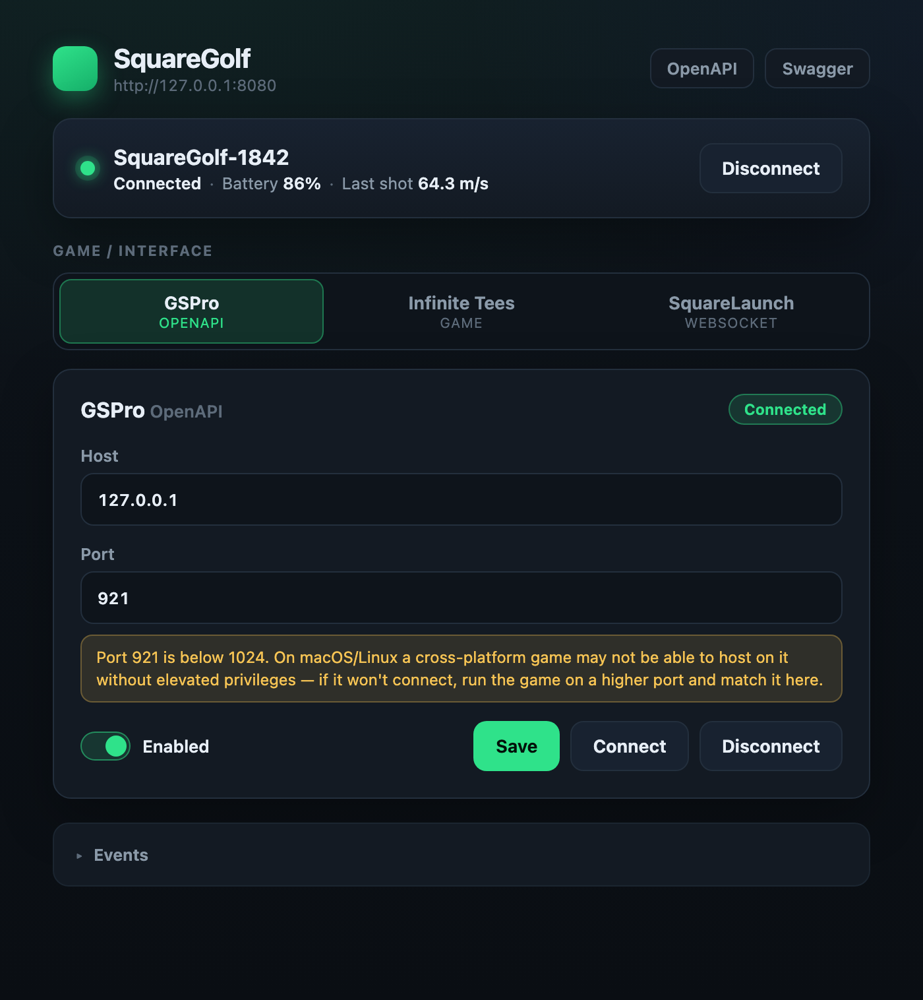
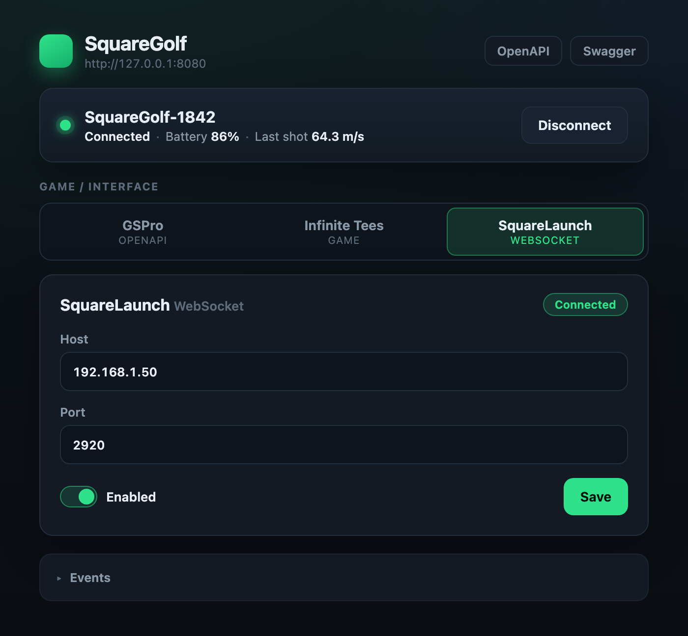

# SquareGolf Connector

SquareGolf Connector is an unofficial Rust/Tauri desktop connector for
SquareGolf launch monitors. It exposes a local OpenAPI server, a desktop control
panel, GSPro/Open Connect integrations, Infinite Tees integration, and a
Nova-style websocket launch-monitor source named SquareLaunch.

Pick one game/interface (GSPro OpenAPI, Infinite Tees, or the SquareLaunch
WebSocket) and tune its port — the picker defaults to GSPro on Windows and the
SquareLaunch WebSocket on macOS/Linux.

| GSPro / OpenAPI | SquareLaunch / WebSocket |
| --- | --- |
|  |  |

## Features

- Native Tauri desktop UI with a Rust backend
- Configurable local OpenAPI server with Swagger UI
- SquareGolf Bluetooth LE device runtime
- GSPro and Infinite Tees TCP integrations
- SquareLaunch WebSocket shot source with `_openlaunch-ws._tcp.local.` discovery
- Persistent user settings in `~/.squaregolf-connector/config.json`
- Headless API binary for automation and smoke testing

## Install

Download the latest build for your platform from the
[Releases page](https://github.com/ShaneBreazeale/squaregolf-connector/releases/latest):

| Platform | Asset | Notes |
| --- | --- | --- |
| macOS (Apple Silicon) | `*_aarch64.dmg` | Open the DMG, drag to Applications. Unsigned, so first launch needs right-click → **Open** (or `xattr -dr com.apple.quarantine "/Applications/SquareGolf Connector.app"`). |
| Windows (x64) | `*_x64-setup.exe` or `*_x64_en-US.msi` | Run the installer. SmartScreen may warn (unsigned) — **More info → Run anyway**. |
| Linux (x86_64) | `*_amd64.AppImage` | `chmod +x` then run. `.deb` and `.rpm` packages are also attached. |

## Requirements

- Rust stable
- Node.js 18 or newer for the black-box emulator script
- macOS, Windows, or Linux (x86_64; published macOS builds target Apple Silicon)
- Bluetooth adapter for SquareGolf hardware
- `cargo-tauri` for desktop app bundling
- Linux only: `libwebkit2gtk-4.1-dev`, `libayatana-appindicator3-dev`, `librsvg2-dev`, `patchelf` (see the [release workflow](.github/workflows/release.yml) for the full apt list)

Install the Tauri CLI when you need to build bundles:

```sh
cargo install tauri-cli --version '^2'
```

## Run The OpenAPI Server

Start the headless API server:

```sh
cargo run --manifest-path src-tauri/Cargo.toml --bin squaregolf-api -- --api-port 5177
```

Open these local URLs:

- Status: `http://127.0.0.1:5177/api/status`
- OpenAPI JSON: `http://127.0.0.1:5177/api-docs/openapi.json`
- Swagger UI: `http://127.0.0.1:5177/swagger-ui`

The API port defaults to `8080`. Override it with either:

```sh
cargo run --manifest-path src-tauri/Cargo.toml --bin squaregolf-api -- --api-port 5177
```

```sh
SQUAREGOLF_API_PORT=5177 cargo run --manifest-path src-tauri/Cargo.toml --bin squaregolf-api
```

## Run The Tauri App

Start the desktop shell during development:

```sh
cargo run --manifest-path src-tauri/Cargo.toml --bin squaregolf-connector -- --api-port 5177
```

The Tauri window loads the static frontend from `frontend/` and connects to the
embedded API server.

## SquareLaunch WebSocket

SquareLaunch is the connector's Nova-style websocket output mode for clients
that consume launch monitor data from the connector. It uses JSON shot messages
like this:

```json
{
  "type": "shot",
  "shot_number": 42,
  "ball_speed_meters_per_second": 65.9,
  "vertical_launch_angle_degrees": 13.4,
  "horizontal_launch_angle_degrees": -2.1,
  "total_spin_rpm": 3120.0,
  "spin_axis_degrees": -9.5
}
```

Enable SquareLaunch with automatic OpenLaunch-compatible mDNS discovery:

```sh
cargo run --manifest-path src-tauri/Cargo.toml --bin squaregolf-api -- \
  --enable-squarelaunch-ws
```

Or use a fixed websocket endpoint:

```sh
cargo run --manifest-path src-tauri/Cargo.toml --bin squaregolf-api -- \
  --enable-squarelaunch-ws \
  --squarelaunch-ws-host 127.0.0.1 \
  --squarelaunch-ws-port 2920
```

Environment equivalents:

```sh
SQUARELAUNCH_WS=1
SQUARELAUNCH_WS_HOST=127.0.0.1
SQUARELAUNCH_WS_PORT=2920
```

## Simulator Integrations

GSPro and Infinite Tees settings can be configured from the UI or the API.
Startup overrides are also available:

```sh
cargo run --manifest-path src-tauri/Cargo.toml --bin squaregolf-api -- \
  --enable-gspro \
  --gspro-host 127.0.0.1 \
  --gspro-port 921 \
  --enable-it \
  --it-host 127.0.0.1 \
  --it-port 999
```

Environment equivalents:

```sh
GSPRO_ENABLED=1
GSPRO_HOST=127.0.0.1
GSPRO_PORT=921
INFINITE_TEES_ENABLED=1
INFINITE_TEES_HOST=127.0.0.1
INFINITE_TEES_PORT=999
```

## Build Releases

### Tagged release (recommended)

Pushing a `v*` tag triggers the [release workflow](.github/workflows/release.yml),
which builds and publishes signed-less bundles for macOS (Apple Silicon), Linux
x86_64, and Windows x64 via `tauri-action`:

```sh
# 1. Bump the version in src-tauri/Cargo.toml, src-tauri/Cargo.lock,
#    and src-tauri/tauri.conf.json (keep them in sync).
# 2. Commit, then tag and push:
git tag v0.3.0
git push origin v0.3.0
```

The workflow can also be started manually from the **Actions** tab
(`workflow_dispatch`) with a tag input. Tags containing `-` (e.g.
`v0.4.0-alpha.1`) publish as a pre-release.

### Local bundles

Build a macOS Tauri app bundle:

```sh
scripts/build-macos-app.sh
```

Create the macOS release zip:

```sh
scripts/package-macos-release.sh 0.3.0
```

Build the Windows executable folder on Windows:

```sh
scripts/build-windows-app.sh
```

Create the Windows release zip on Windows:

```sh
scripts/package-windows-release.sh 0.3.0
```

## Development

Run the Rust test suite:

```sh
cargo test --manifest-path src-tauri/Cargo.toml
```

Run the frontend contract test (a fake-DOM harness that guards
`frontend/main.js`; add new queried element ids to its selector list when you
change the UI):

```sh
node scripts/test-frontend-ui.mjs
```

Check all Rust binaries:

```sh
cargo check --manifest-path src-tauri/Cargo.toml --bins
```

The frontend is static (no build step) — Tauri loads `frontend/` directly. For
a live desktop shell with devtools use:

```sh
cargo tauri dev
```

Run the black-box connector emulator against a running API:

```sh
cargo run --manifest-path src-tauri/Cargo.toml --bin squaregolf-api
scripts/emulate-connector.mjs
```

Use a custom API URL when needed:

```sh
SQUAREGOLF_API_BASE=http://127.0.0.1:5177 scripts/emulate-connector.mjs
```

Run a fake SquareGolf launch monitor device and send sample shots into the
running connector:

```sh
SQUAREGOLF_API_BASE=http://127.0.0.1:5177 scripts/emulate-square-lm.mjs
```

The emulator connects through the Device panel path, sends three raw SquareGolf
notification samples, and then lets you press Enter to send more shots.

Format the Rust code:

```sh
cargo fmt --manifest-path src-tauri/Cargo.toml
```

## Project Layout

- `src-tauri/` - Rust backend, OpenAPI server, Tauri shell, protocol code, tests
- `frontend/` - Static desktop frontend loaded by Tauri (no build step)
- `scripts/` - Release/packaging scripts, emulators, frontend contract test
- `.github/workflows/` - Multi-platform release CI
- `icon.png` - Source icon used to generate Tauri bundle icons

## Disclaimer

This is an unofficial community connector. It is not affiliated with or endorsed
by SquareGolf, GSPro, Infinite Tees, or OpenLaunch.

## License

See [LICENSE](LICENSE).
